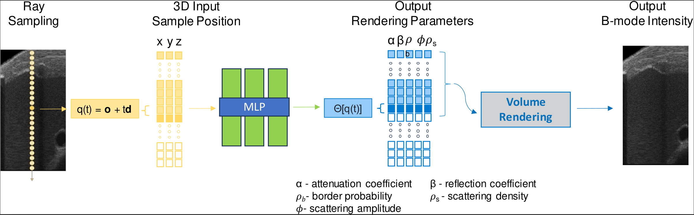
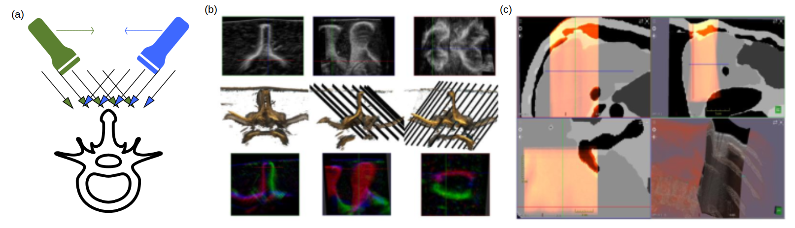
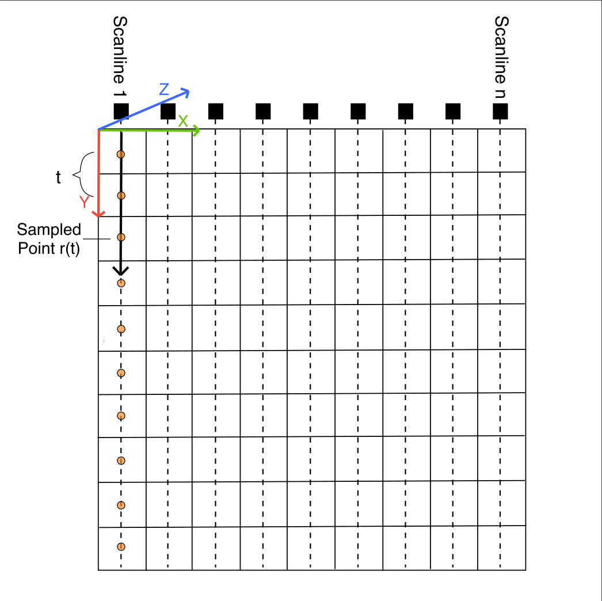

# Ultra-NeRF: Neural Radiance Fields for Ultrasound Imaging

[Data](https://drive.google.com/drive/folders/1aDc3wA2gugUKS6IABsH_TNWQ5Ijk7tmi?usp=drive_link)

Tensorflow implementation of optimizing a neural representation for a multiple ultrasound sweeps for the same region of interest.<br><br>

[Ultra-NeRF: Neural Radiance Fields for Ultrasound Imaging](https://openreview.net/pdf?id=x4McMBwVyi)  
 [Magdalena Wysocki](https://scholar.google.com/citations?hl=pl&user=5A-PRkoAAAAJ)\*<sup>1</sup>,
 [Mohammad Farid Azampour](https://www.cs.cit.tum.de/camp/members/mohammad-farid-azampour/)\*<sup>1</sup>,<sup>2</sup>,
 [Christine Eilers](https://www.cs.cit.tum.de/camp/members/christine-eilers/)<sup>1</sup>,
 [Benjamin Busam](https://www.cs.cit.tum.de/camp/members/benjamin-busam/)<sup>1</sup>,<sup>3</sup>,
 [Mehrdad Salehi](https://scholar.google.de/citations?user=rKnP3wYAAAAJ&hl=en)<sup>1</sup>,
 [Nassir Navab](https://www.professoren.tum.de/en/navab-nassir)<sup>1</sup> <br>
 <sup>1</sup>Technical University of Munich (TUM), <sup>2</sup>Sharif University of Technology, <sup>3</sup>3Dwe.ai <br>
\*denotes equal contribution  
in MIDL 2023 (Oral Presentation)

# Setup
To setup a conda environment, download example training data, begin the training process, and launch Tensorboard:
```
conda env create -f environment.yml
conda activate ultra_nerf
```

# Running code
> **Note**
> Please, contact me in case of any issues with running the code.

```
python run_ultra_nerf.py --config conf_us.txt --expname test_generated --n_iters 200000 --loss ssim --i_embed_gauss 0 --i_img 2000 --i_print 2000  --i_weights 2000

```

# Pipeline


# Data
Our data consist of several sweeps of the same region of interest taken from different observation angles (a).
The poses are calibrated.

Synthetic data (c):
0.31x 0.27 mm, depth 140 mm, width 80 mm

Phantom data (b):
0.22 x.07 mm, depth 100 mm, width 38 mm

## Link to the data: [Data]([[https://syncandshare.lrz.de/getlink/fi3EGowa2yGEkUr3yZFUwn/](https://drive.google.com/drive/folders/1gzpw98AZBk6A7TcUUDPCgjkfWS9Ivtow?usp=sharing](https://drive.google.com/drive/folders/1aDc3wA2gugUKS6IABsH_TNWQ5Ijk7tmi?usp=drive_link)))


The image shows the coordinate system and sampling method (equidistant sampling).



# Pretrained models

Added for the synthetic dataset. For the phantom dataset will soon be updated. 

# Sample results

[Sample results](https://syncandshare.lrz.de/getlink/fi3kUddouDyuxpH5sugefP/)

## Citation

```
@inproceedings{wysocki2023ultranerf,
  title={Ultra-NeRF: Neural Radiance Fields for Ultrasound Imaging},
  author={Magdalena Wysocki and Mohammad Farid Azampour and Christine Eilers and Benjamin Busam and Mehrdad Salehi and Nassir Navab},
  year={2023},
  booktitle={MIDL},
}
```

## LICENSE

`ultra-nerf` is available under the [MIT License](https://opensource.org/licenses/MIT). For more details see: [LICENSE](LICENSE) and [ACKNOWLEDGEMENTS](ACKNOWLEDGEMENTS).

# Acknowledgments

Large parts of the code are from the tensorboard [NeRF](https://github.com/bmild/nerf/) implementation. See [ACKNOWLEDGEMENTS](ACKNOWLEDGEMENTS).
